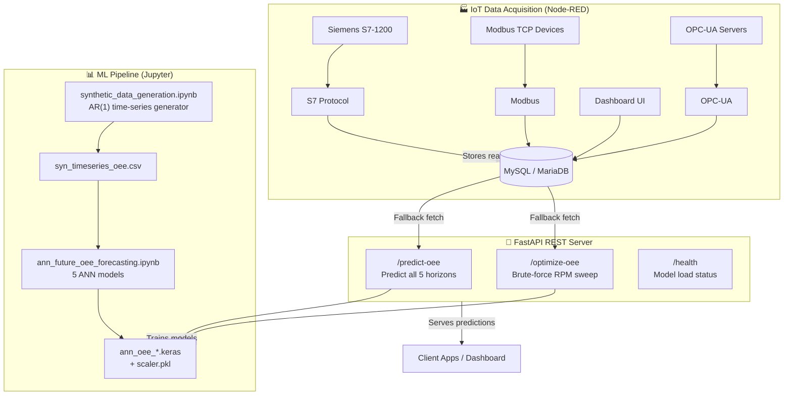
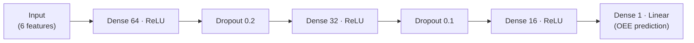
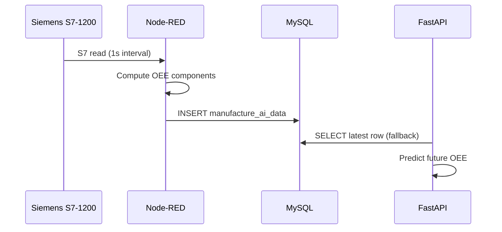
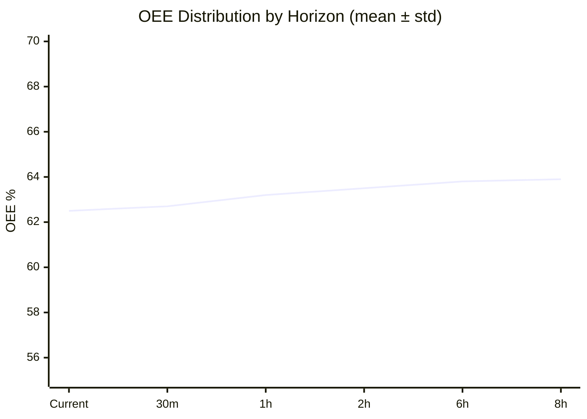
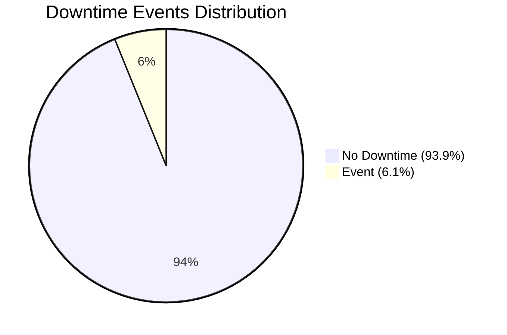
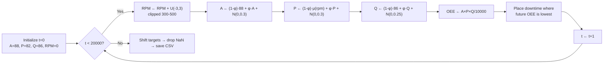
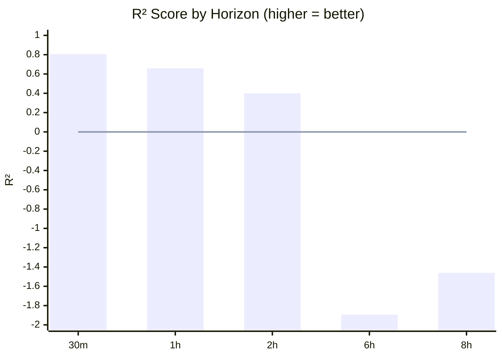
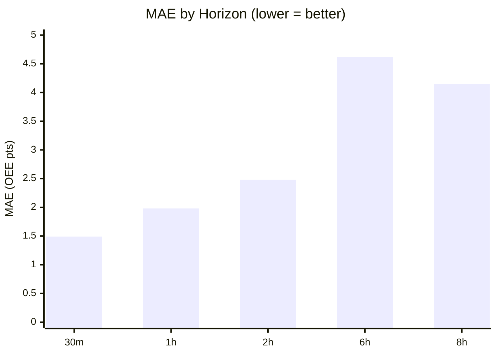
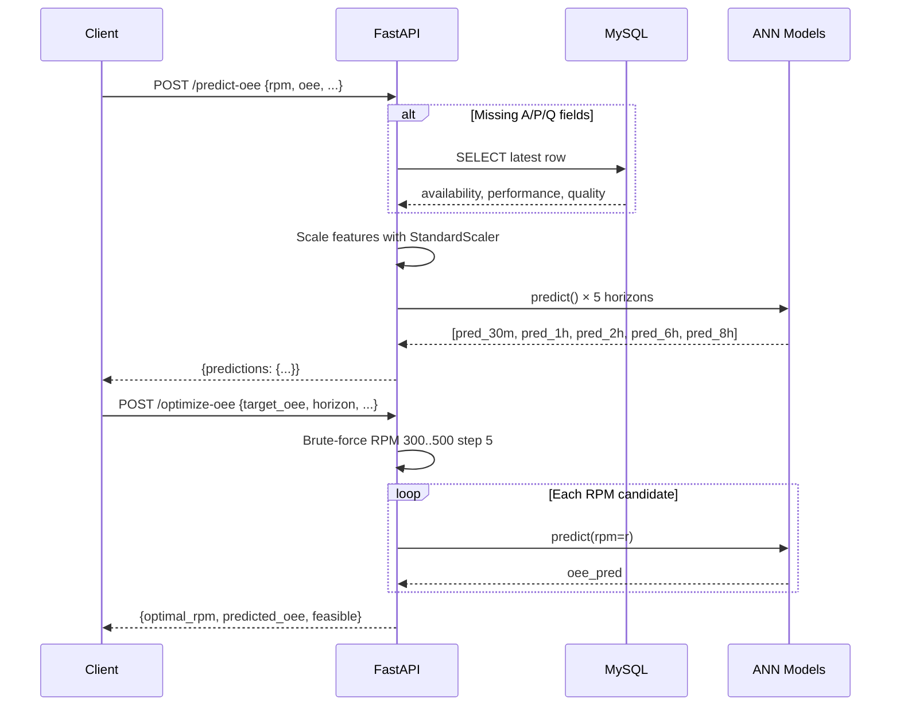

# IoT-AIML Platform

Manufacturing OEE (Overall Equipment Effectiveness) prediction and optimization platform combining IoT data acquisition (Node-RED), machine learning forecasting (ANN), and a REST API for real-time inference.

<div align="center">


**Predict future OEE up to 8 hours ahead · Optimize RPM in real-time · Monitor via IoT dashboard**

</div>

---

## Table of Contents

- [Architecture Overview](#architecture-overview)
- [Mathematical Foundation](#mathematical-foundation)
- [Components](#components)
  - [1. Node-RED — IoT Data Acquisition](#1-node-red--iot-data-acquisition)
  - [2. Synthetic Data Generation](#2-synthetic-data-generation)
  - [3. ANN Forecasting Models](#3-ann-forecasting-models)
  - [4. FastAPI — REST API](#4-fastapi--rest-api)
  - [5. Database Layer](#5-database-layer)
- [Setup & Installation](#setup--installation)
- [API Reference](#api-reference)
- [Development Notes](#development-notes)

---

## Architecture Overview



---

## Mathematical Foundation

### OEE Calculation

$$OEE = \frac{\text{Availability} \times \text{Performance} \times \text{Quality}}{10000}$$

Where each component is a percentage (0–100). The division by 10,000 converts the product of three percentages to a single percentage value.

### Data Generation — AR(1) Process

Each signal follows a first-order autoregressive process with mean reversion:

$$x_t = (1-\phi)\mu + \phi \cdot x_{t-1} + \varepsilon_t, \quad \varepsilon_t \sim \mathcal{N}(0,\sigma^2)$$

- $\phi = 0.998$ (strong persistence — realistic for machinery)
- $\mu$ is the long-run mean (88.0 for Availability, 86.0 for Quality)
- Performance has an RPM-conditional target: $\mu_{perf} = 82.0 + (rpm - 400) \times 0.02$

RPM follows a random walk with drift:

$$rpm_t = \text{clip}(rpm_{t-1} + U(-3, 3), \; 300, 500)$$

### ANN Model Architecture



### Loss Function

$$\mathcal{L} = \frac{1}{n}\sum_{i=1}^{n}(y_i - \hat{y}_i)^2$$

Optimized with Adam ($\text{lr}=0.001$), early stopping at patience=10 on validation loss.

### Evaluation Metrics

$$R^2 = 1 - \frac{\sum (y_i - \hat{y}_i)^2}{\sum (y_i - \bar{y})^2}$$

$$MAE = \frac{1}{n}\sum |y_i - \hat{y}_i|$$

$$RMSE = \sqrt{\frac{1}{n}\sum (y_i - \hat{y}_i)^2}$$

$$MAPE = \frac{100}{n}\sum \left|\frac{y_i - \hat{y}_i}{y_i}\right|$$

---

## Components

### 1. Node-RED — IoT Data Acquisition

Connects to industrial machinery via multiple protocols and stores data in MySQL.

| Feature | Details |
|--------:|---------|
| **PLC** | Siemens S7-1200 at `10.11.15.193` (rack 0, slot 1/2) |
| **Modbus** | TCP client to `192.168.0.123` |
| **OPC-UA** | Server/client connectivity |
| **Databases** | `lathe` |
| **Dashboard** | OEE monitoring, machine controls, CAD viewer, home automation |
| **Flow Tabs** | Actuator DB |

#### Data Flow



**Dependencies**: `node-red-contrib-modbus`, `node-red-contrib-opcua`, `node-red-node-s7`, `node-red-node-mysql`, `node-red-dashboard`

---

### 2. Synthetic Data Generation

**Notebook**: `ml_model/synthetic_data_generation.ipynb`

Generates 19,520 rows of realistic OEE time-series for model training.

#### Dataset Summary



| Column | Type | Range | Description |
|--------|------|-------|-------------|
| `timestamp` | datetime | 13.6 day span | 1-minute resolution |
| `rpm` | float | 300–500 | Spindle speed |
| `availability` | float | 40–100 | AR(1) with φ=0.998 |
| `performance` | float | 30–100 | AR(1) + RPM coupling |
| `quality` | float | 40–100 | AR(1) with φ=0.998 |
| `current_oee` | float | 10–100 | A×P×Q / 10000 |
| `downtime_minutes` | float | 0 or ~14 mean | Exp(14) duration, capped at 40 |
| `target_oee_30m..8h` | float | 10–100 | Future OEE at each horizon |



> [!NOTE]
> 4 of the 1,200 placed events round to zero duration and are excluded, leaving 1,196 effective events.

#### Generation Algorithm



---

### 3. ANN Forecasting Models

**Notebook**: `ml_model/ann_future_oee_forecasting.ipynb`

Five independent feedforward ANNs, one per horizon. Each uses the same architecture with different target columns.

#### Data Split

| Set | Rows | % | Period |
|-----|------|---|--------|
| **Train** | 15,616 | 80% | First ~10.8 days |
| **Validation** | 1,952 | 10% | Next ~1.4 days |
| **Test** | 1,952 | 10% | Final ~1.4 days |

Split is **chronological** (not random) to simulate real deployment conditions.

#### Training Configuration

- **Optimizer**: Adam ($\text{lr} = 10^{-3}$)
- **Loss**: MSE ($\mathcal{L} = \frac{1}{n}\sum(y - \hat{y})^2$)
- **Batch size**: 32
- **Max epochs**: 100
- **Early stopping**: Patience 10, min delta $10^{-5}$, restore best weights
- **Input features**: rpm, availability, performance, quality, current_oee, downtime_minutes

#### Model Performance





| Horizon | $R^2$ | MAE | RMSE | MAPE (%) | Bias | Quality |
|:-------:|:-----:|:---:|:----:|:--------:|:----:|:-------:|
| **30m** | 0.8059 | 1.49 | 1.84 | 2.44 | -0.16 | ✅ Good |
| **1h**  | 0.6578 | 1.98 | 2.42 | 3.24 | -0.01 | ✅ Fair |
| **2h**  | 0.4003 | 2.48 | 3.13 | 4.01 | -0.70 | ⚠️ Weak |
| **6h**  | -1.8938 | 4.62 | 5.38 | 7.90 | -2.94 | ❌ Fails |
| **8h**  | -1.4614 | 4.15 | 4.70 | 7.11 | -0.24 | ❌ Fails |

> [!WARNING]
> **Short horizons (30m–1h) are production-ready.** Longer horizons suffer because the feedforward ANN has no temporal memory. Upgrade path: replace with LSTM/GRU using sliding lookback windows and engineered lag features.

#### Architecture Details

Each model has ~6,300 trainable parameters:

| Layer | Type | Units | Params | Shape |
|:-----:|:----:|:-----:|:------:|:-----:|
| 1 | Dense + ReLU | 64 | 448 | (6→64) |
| 2 | Dropout | 0.2 | 0 | — |
| 3 | Dense + ReLU | 32 | 2,080 | (64→32) |
| 4 | Dropout | 0.1 | 0 | — |
| 5 | Dense + ReLU | 16 | 528 | (32→16) |
| 6 | Dense (linear) | 1 | 17 | (16→1) |

#### Saved Artifacts (`ml_model/models/`)

```tree
ml_model/models/
├── ann_oee_30m.keras   (72 KB)
├── ann_oee_1h.keras    (72 KB)
├── ann_oee_2h.keras    (72 KB)
├── ann_oee_6h.keras    (72 KB)
├── ann_oee_8h.keras    (72 KB)
└── scaler.pkl          (2 KB)
```

---

### 4. FastAPI — REST API

Single-server REST API for OEE prediction and RPM optimization.

#### Request/Response Flow



#### Endpoints

| Method | Path | Description |
|:------:|:----:|:------------|
| `GET` | `/health` | Health check + model load status |
| `POST` | `/predict-oee` | Predict OEE for all 5 horizons |
| `POST` | `/optimize-oee` | Find optimal RPM to reach target OEE |

<details>
<summary><b>📬 POST /predict-oee — Full Reference</b></summary>

**Request Body:**

```json
{
  "current_rpm": 400.0,
  "current_oee": 62.0,
  "availability": 88.0,
  "performance": 82.0,
  "quality": 86.0,
  "downtime_minutes": 0.0
}
```

> All fields except `current_rpm` and `current_oee` are optional. Missing values are fetched from MySQL.

**Response:**

```json
{
  "current_rpm": 400.0,
  "current_oee": 62.0,
  "predictions": {
    "pred_30m": 61.62,
    "pred_1h": 61.99,
    "pred_2h": 61.44,
    "pred_6h": 61.38,
    "pred_8h": 61.64
  }
}
```
</details>

<details>
<summary><b>📬 POST /optimize-oee — Full Reference</b></summary>

**Request Body:**

```json
{
  "target_oee": 70.0,
  "horizon": "1h",
  "current_rpm": 400.0,
  "current_oee": 62.0,
  "availability": 88.0,
  "performance": 82.0,
  "quality": 86.0,
  "downtime_minutes": 0.0
}
```

**Response (feasible):**

```json
{
  "current_oee": 62.0,
  "target_oee": 70.0,
  "optimal_rpm": 440.0,
  "optimal_hz": 44.0,
  "predicted_oee": 70.2,
  "feasible": true,
  "search_range": {"min_rpm": 300, "max_rpm": 500}
}
```

**Response (infeasible):**

```json
{
  "current_oee": 62.0,
  "target_oee": 95.0,
  "optimal_rpm": 400.0,
  "optimal_hz": 40.0,
  "predicted_oee": 62.0,
  "feasible": false,
  "search_range": {"min_rpm": 300, "max_rpm": 500}
}
```

The optimizer performs a brute-force sweep over RPM ∈ {300, 305, ..., 500} and returns the RPM yielding the highest predicted OEE. If no RPM reaches the target, `feasible` is `false` and `optimal_rpm` defaults to `current_rpm`.
</details>

---

### 5. Database Layer

| Setting | Default |
|:--------|:--------|
| Host | `localhost` |
| Port | `3306` |
| User | `root` |
| Password | `iotaimlproject` |
| Database | `lathe` |
| Table | `manufacture_ai_data` |

Async connection via `mysql+asyncmy://` using the `databases` library.

---

## Setup & Installation

### Prerequisites

- Python 3.10+
- Node.js 18+ (for Node-RED)
- MySQL / MariaDB
- TensorFlow-compatible environment (CPU is sufficient for inference)

### Clone & Install

```bash
git clone <repo-url>
cd iot-aiml-project

# Python (API + ML)
pip install -r api/requirements.txt

# Node-RED
npm install
```

### Configuration

Create a `.env` file in the project root (all settings are optional — defaults shown):

```ini
DB_HOST=localhost
DB_PORT=3306
DB_USER=root
DB_PASSWORD=iotaimlproject
DB_DATABASE=lathe
DB_TABLE=manufacture_ai_data
MODEL_DIR=ml_model/models
```

### Running

```bash
# Start FastAPI server
uvicorn api.main:app --host 0.0.0.0 --port 8000

# Node-RED (separate terminal)
node-red
```

### Regenerating ML Models (Optional)

```bash
# Run the Jupyter notebooks in order:
# 1. ml_model/synthetic_data_generation.ipynb
# 2. ml_model/ann_future_oee_forecasting.ipynb

# Or use the provided Python requirements:
pip install -r api/requirements.txt
jupyter notebook ml_model/ann_future_oee_forecasting.ipynb
```

---

## Project Structure

```
iot-aiml-project/
├── api/                                    # FastAPI REST service
│   ├── main.py                             # App entry, lifespan, health
│   ├── config.py                           # Pydantic Settings
│   ├── database.py                         # Async MySQL (databases lib)
│   ├── requirements.txt                    # Python dependencies
│   ├── routers/
│   │   ├── predict.py                      # POST /predict-oee
│   │   └── optimize.py                     # POST /optimize-oee
│   ├── schemas/
│   │   └── oee.py                          # Pydantic models
│   └── services/
│       ├── predictor.py                    # ANN load + predict
│       └── optimizer.py                    # RPM sweep optimization
├── ml_model/                               # ML pipeline
│   ├── synthetic_data_generation.ipynb     # Generate 19,520-row dataset
│   ├── ann_future_oee_forecasting.ipynb    # Train 5 ANN models
│   ├── data/
│   │   ├── syn_timeseries_oee.csv          # Generated dataset
│   │   └── lathe_job_status_data.csv       # Seed reference (5 rows)
│   └── models/
│       ├── ann_oee_30m.keras               # Trained: 30-min horizon
│       ├── ann_oee_1h.keras                # Trained: 1-hour horizon
│       ├── ann_oee_2h.keras                # Trained: 2-hour horizon
│       ├── ann_oee_6h.keras                # Trained: 6-hour horizon
│       ├── ann_oee_8h.keras                # Trained: 8-hour horizon
│       └── scaler.pkl                      # StandardScaler
├── lib/flows/                              # Node-RED subflows
├── flows.json                              # Node-RED flow definitions
├── settings.js                             # Node-RED runtime config
└── package.json                            # Node-RED dependencies
```

---

## Development Notes

### Import Convention

API uses relative imports with the `api.` prefix (e.g., `from api.config import settings`). Python module resolution is case-sensitive regardless of filesystem.

### Notebook Execution Order

1. **synthetic_data_generation.ipynb** (25 cells): Dependencies → seed data → AR(1) generation → target shifts → save CSV → data summary → 4 visualization panels
2. **ann_future_oee_forecasting.ipynb** (32 cells): Setup → data loading → feature split → model architecture → 5× training (one cell per horizon) → save models → results → scatter/metrics/time-series plots → feature importance → comprehensive residual diagnostics

### Known Limitations

- **6h/8h horizons**: Feedforward ANN with 6 static features lacks temporal context. $R^2 < 0$ for long horizons. Upgrade: LSTM/GRU with lookback windows.
- **Optimizer retracing**: TensorFlow retraces the prediction graph on each RPM sweep iteration (~6 calls logged). Negligible after warmup.
- **DB credentials**: Hardcoded defaults in `config.py`. Use `.env` file or environment variables in production.
- **Plot rendering**: Plot images cannot be rendered inline via MCP. Visual output assumed present but unverifiable through the tool interface.

---

## License

MIT
